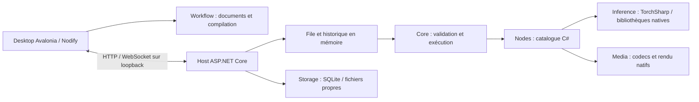

# Architecture

Contracts contient les données JSON échangées par Core et Host ainsi que les contrats des valeurs d'exécution internes. Workflow ne dépend ni de Nodify ni des tenseurs. Le document JSON conserve les champs inconnus et les extensions ; le prompt n'est qu'une projection exécutable. Les erreurs de compilation sont explicites.

Desktop possède les documents et surveille son processus Host. Les modèles, storages natifs et jobs restent dans Host. Un crash du moteur ne doit pas effacer le document ni provoquer de resoumission automatique. La connexion locale n'envoie ni télémétrie ni poids.

`Nodes` fournit les utilitaires JSON ; `Nodes.Tensor` compose ce registre avec les générateurs/traitements SIGMAS et PreviewAny. Host et l'outil Catalogue emploient cette même composition. Lire les schémas ne charge pas libtorch. Le Desktop ne référence pas Inference. Les résultats et UI sont séparés par `NodeExecutionOutput` ; l'historique ne possède que des snapshots gérés.

`Tokenization` est une bibliothèque C# distincte sans dépendance à Inference ou TorchSharp. Elle possède les ressources CLIP et Unicode figées, les IDs, poids et séquences textuelles ; `tools/ComfySharp.Tokenize` l'utilise pour le diagnostic local. Son intégration aux futurs encodeurs passera par ces contrats textuels, sans déplacer les tenseurs hors du Host.

Les distributions placent Desktop à la racine et toutes les dépendances du Host dans `host/`. Cette isolation permet notamment de garder les versions SkiaSharp propres à Avalonia et TorchSharp. Les bibliothèques natives CPU/CUDA et leurs verrous sont sélectionnés au niveau des processus consommateurs, sans injecter ces payloads dans les bibliothèques communes ou l'inspecteur de métadonnées.

Une seule exécution active initialement. Le propriétaire de la file associe chaque annulation à l'identité du job sous verrou ; le moteur observe son jeton. Les événements HTTP/WS sont une adaptation des événements métier, pas une dépendance du moteur au serveur.

Les lecteurs de poids vérifient structure, tailles et offsets avant allocation. Aucune exécution de pickle ou chargement arbitraire de code n'est acceptable. Les formats non encore portés échouent explicitement.

La disponibilité d'un package natif ne vaut pas validation de backend. Chaque opération et famille doit recevoir une preuve versionnée. Les [valeurs natives](RUNTIME_VALUES.md) utilisent des références possédées par les contextes d'invocation, la mémoïsation du job et les résultats. Leur dernière référence libère la ressource. Le cache tensoriel persistant et l'offload restent à implémenter sur cette base.
